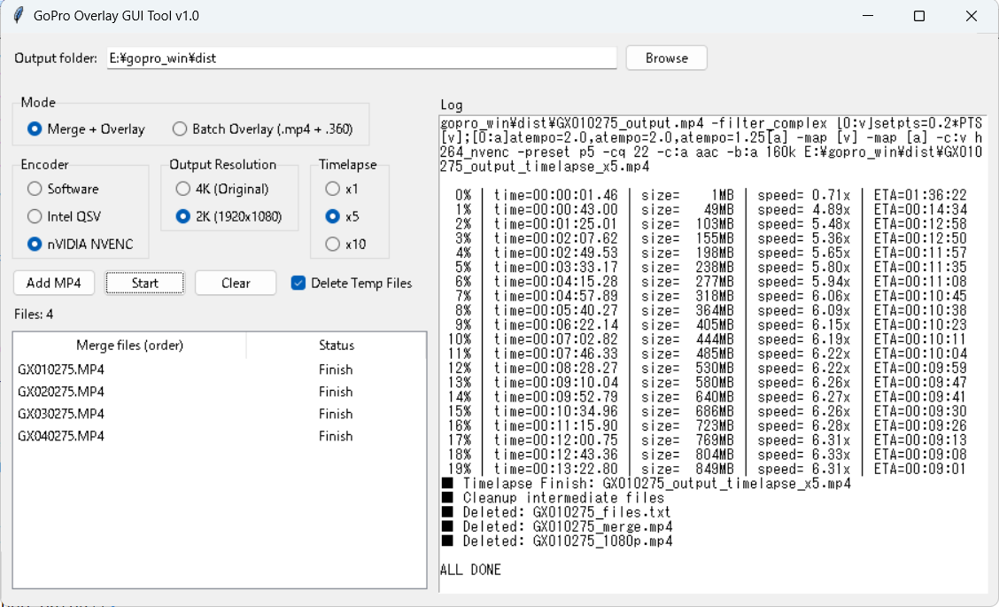
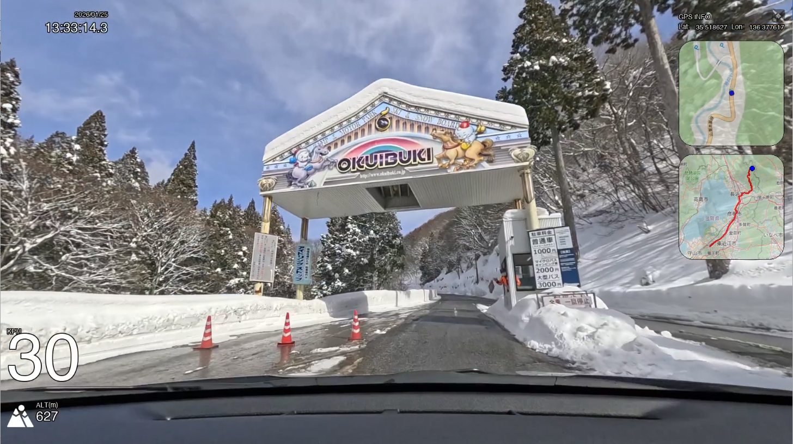
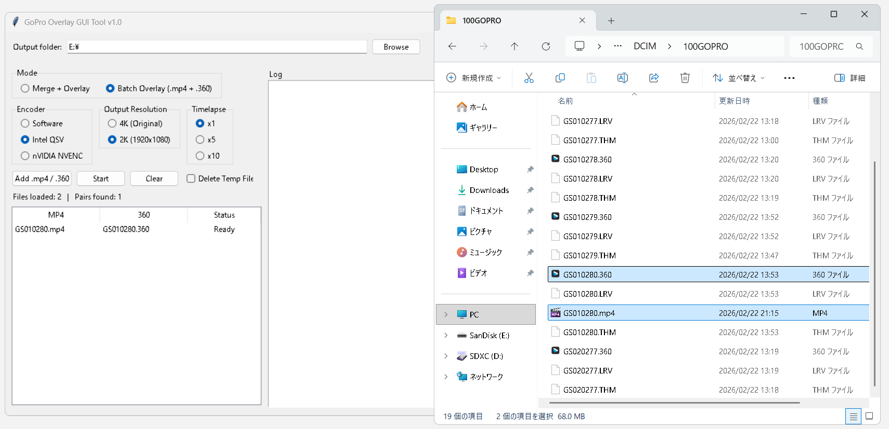
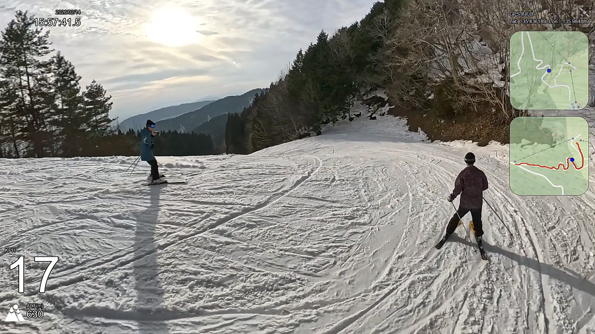

[for Japansese](README.md)

# GoPro Overlay GUI Tool


A GUI tool that overlays (composites) GoPro telemetry (GPS / speed, etc.) and dashboard-style info onto your videos.  
It includes features for both **drive videos** and **360° videos**.

This project makes it easy to use the amazing and much-appreciated
[time4tea](https://github.com/time4tea)’s [gopro-dashboard-overlay](https://github.com/time4tea/gopro-dashboard-overlay) from a GUI.

Compatible with Windows / macOS.

This repository is released under **GPL-3.0**. See `LICENSE`.

<br>
<br>

## How to Use

### Mode: “Merge + Overlay”
When recording for a long time, GoPro will automatically split the video into multiple files.  
Drag & drop the MP4 files in chronological order, and the tool will merge them into a single MP4 and apply the GPS overlay.

  
  
<br>

### Mode: “Batch Overlay”
This mode is for 360° videos.  
Set keyframes in GoPro Player (etc.) and export in 4K.  
Please export as a full-length clip (no cuts), otherwise the GPS overlay may become out of sync.  
For reading GPS data, drag & drop **both** the exported `.MP4` and the original `.360` file.  
Batch processing of multiple sets is supported.

  
  
<br>

### Encoder Selection
You can choose from three options:  
- Software encoding  
- CPU hardware encoding (intel / AppleSilicon)  
- nVIDIA hardware encoding  
<br>

### Output Resolution
You can choose 4K or 2K.  
If you select 4K, the 1080p transcode step can be skipped,  
but the overlay process may take longer.  
<br>

### Timelapse
For long drive videos, you can choose x5 or x10.  
x1 means no timelapse.  
<br>

### Delete Intermediate Files
If checked, unnecessary intermediate files will be removed after processing finishes.  
<br>

## Project Structure

- `gopro_overlay_GUI.py` — main GUI tool
- `build.spec` — PyInstaller spec for building a standalone executable
- `requirements.txt` — Python dependencies
- `third_party/` — bundled third-party components (FFmpeg, Roboto font, gopro-dashboard, etc.)

For third-party license details, see `THIRD_PARTY_NOTICES.md`.

<br>
<br>

## Requirements

- Apple Silicon Mac (recommended)
- Windows 10/11 (recommended)
- Tested with Python 3.14
- FFmpeg is bundled in `third_party/ffmpeg/` (`ffmpeg.exe` / `ffprobe.exe`)

<br>
<br>

## Build the EXE (PyInstaller)
### For Windows
Prepare a virtual environment:
```bash
python -m venv venv
venv\Scripts\activate
```

Install dependencies:
```bash
pip install -r requirements.txt
```

Build using the included spec:
```bash
PyInstaller -y build.spec
```

The output will be generated under `dist/` (the folder name depends on the spec).

> Notes:
> - This `build.spec` references bundled assets under `third_party/` (FFmpeg, fonts, etc.).
> - If you change paths, update `build.spec` accordingly.

<br>

### For macOS
Prepare a virtual environment:
```bash
python3 -m venv venv
source venv/bin/activate
```

Install dependencies:
```bash
pip install -U pip
pip install -r requirements.txt
```

Build using the included spec:
```bash
PyInstaller -y build.spec
```

The output will be generated under `dist/` (the folder name depends on the spec).

> Notes:
> - This `build.spec` references bundled assets under `third_party/` (FFmpeg, fonts, etc.).
> - If you change paths, update `build.spec` accordingly.

<br>
<br>

## Credits / Third-Party

Bundled components:

- **FFmpeg / FFprobe** — redistributed Windows builds (`third_party/ffmpeg/`)  
  This repository includes Windows FFmpeg binaries at:  
  `third_party/ffmpeg/ffmpeg.exe`  
  `third_party/ffmpeg/ffprobe.exe`  
  These are redistributed builds from [gyan.dev](https://www.gyan.dev/ffmpeg/builds/).
  <br><br>
  `third_party/ffmpeg/ffmpeg`  
  `third_party/ffmpeg/ffprobe`  
  These are redistributed builds from [evermeet.cx](https://evermeet.cx/ffmpeg/).  
  See `third_party/ffmpeg/LICENSE` for details.  

- **Roboto font** — `googlefonts/roboto-3-classic` (OFL-1.1, `third_party/Roboto/`)  

- **gopro-dashboard overlay script** — included unmodified from `time4tea/gopro-dashboard-overlay`
  (GPL-3.0, `third_party/gopro-dashboard/`)  
  See `THIRD_PARTY_NOTICES.md` for details.

<br>
<br>

## License

- This project: **GPL-3.0** (`LICENSE`)
- Third-party components: see `THIRD_PARTY_NOTICES.md` and the license files under `third_party/`.
