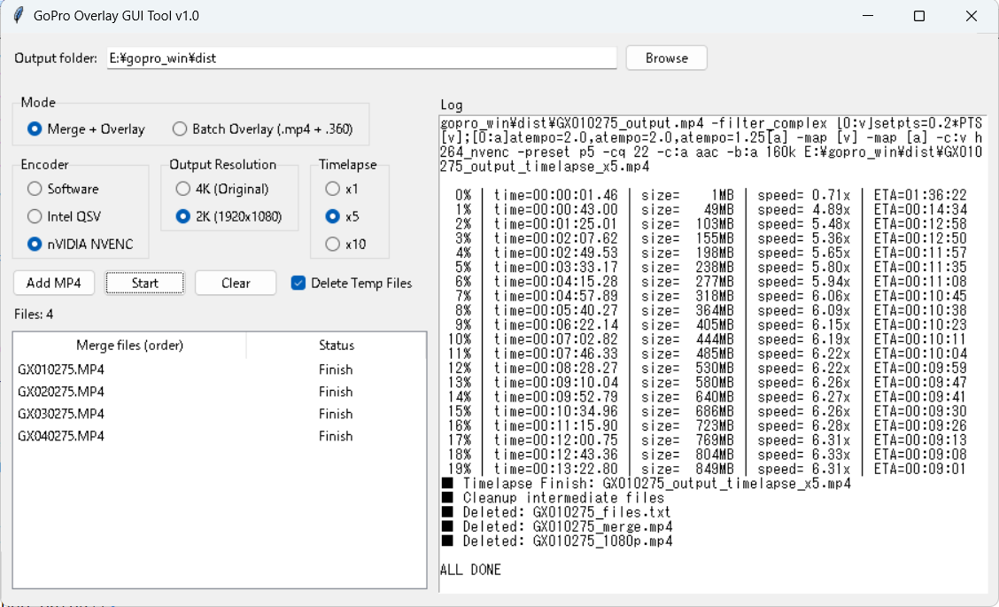
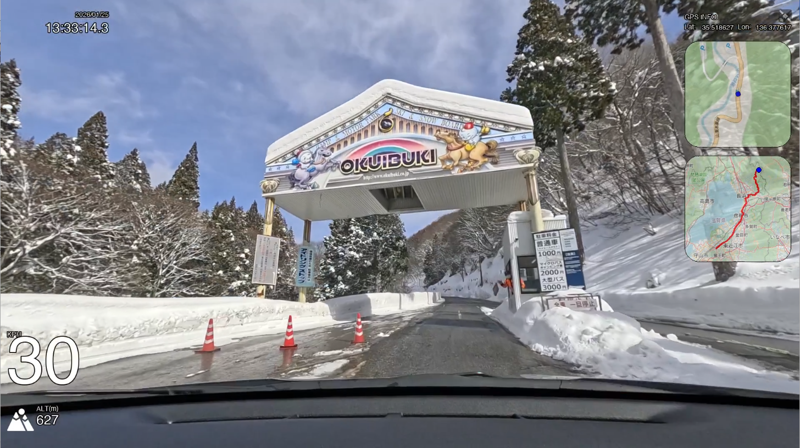
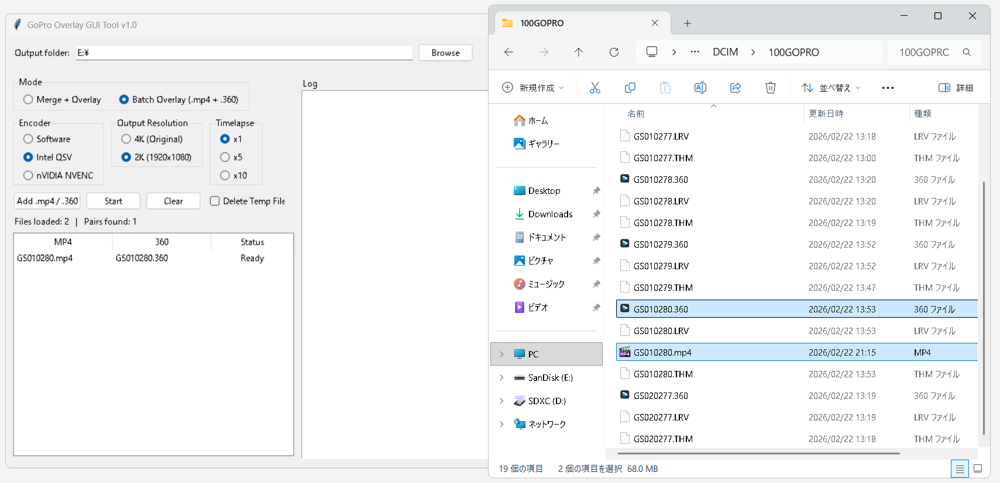
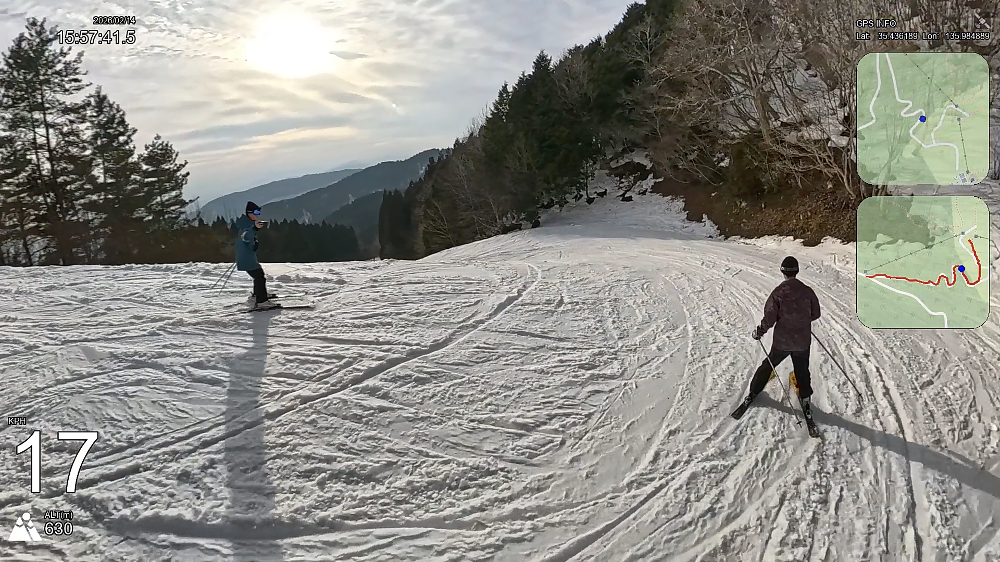

[for Japansese](README.md)

# GoPro Overlay GUI Tool

Uses gopro-overlay 0.134.0 (upstream main: `8e26ee5`).
Upstream changes are integrated through the Python dependency and bundled dashboard, preserving the GUI repository layout.
The GUI extension handles a 0.134.0 boundary issue in speed/gradient calculations for short video segments.

Version 1.10: final overlay uses the selected hardware encoder with a 7.5Mbps target and 15Mbps peak. Software retains CPU defaults. Per-source telemetry processing is preserved.


A GUI tool that overlays (composites) GoPro telemetry (GPS / speed, etc.) and dashboard-style info onto your videos.  
It includes features for both **drive videos** and **360° videos**.

This project makes it easy to use the amazing and much-appreciated
[time4tea](https://github.com/time4tea)’s [gopro-dashboard-overlay](https://github.com/time4tea/gopro-dashboard-overlay) from a GUI.

Compatible with Windows / macOS.

This repository is released under **GPL-3.0**. See `LICENSE`.

<br>
<br>

## How to Use

### Mode: “Merge + Overlay”
When recording for a long time, GoPro will automatically split the video into multiple files.  
Drag & drop the MP4 files in chronological order, and the tool will merge them into a single MP4 and apply the GPS overlay. When a text file list is loaded with `Load File List` or drag-and-drop, files are merged in the order written in the text file (one path per line or ffconcat `file 'path'` syntax). Relative paths are resolved from the text file's folder.

  
  
<br>

### Mode: “Batch Overlay”
This mode is for 360° videos.  
Set keyframes in GoPro Player (etc.) and export in 4K.  
Please export as a full-length clip (no cuts), otherwise the GPS overlay may become out of sync.  
For reading GPS data, drag & drop **both** the exported `.MP4` and the original `.360` file.  
Batch processing of multiple sets is supported.

  
  
<br>

### Encoder Selection
You can choose from four options:
- Software encoding  
- CPU hardware encoding (intel / AppleSilicon)  
- nVIDIA hardware encoding  
- AMD Radeon AMF hardware encoding on Windows (including Ryzen AI Max+ 395 / Radeon 8060S)
<br>

### Output Resolution
You can choose 4K or 2K.  
If you select 4K, the 1080p transcode step can be skipped,  
but the overlay process may take longer.  
<br>

### Timelapse
For long drive videos, you can choose x5 or x10.  
x1 means no timelapse.  
<br>

### Overlay Timezone
You can select the timezone used by the date/time overlay.  
The default is Japan (`Asia/Tokyo`). For footage recorded abroad, select the recording location's timezone,
for example `Europe/Helsinki` for Finland. Region-based timezone names automatically account for daylight saving time.
<br>

### GPS Logger Fallback
You can select a GPS logger `.gpx` file. Valid GoPro GPS samples remain primary; GPX data is used only
for samples rejected because of missing lock, poor DOP, excessive speed, or another GPS validity filter.
UTC timestamps align the data automatically, and logger gaps longer than 60 seconds are not interpolated.
<br>

### Delete Intermediate Files
If checked, unnecessary intermediate files will be removed after processing finishes.  
<br>

## Project Structure

- `gopro_overlay_GUI.py` — main GUI tool
- `build.spec` — PyInstaller spec for building a standalone executable
- `requirements.txt` — Python dependencies
- `third_party/` — bundled third-party components (FFmpeg, Roboto font, gopro-dashboard, etc.)

For third-party license details, see `THIRD_PARTY_NOTICES.md`.

<br>
<br>

## Requirements

- Apple Silicon Mac (recommended)
- Windows 10/11 (recommended)
- Tested with Python 3.14
- FFmpeg is bundled in `third_party/ffmpeg/` (`ffmpeg.exe` / `ffprobe.exe`)

<br>
<br>

## Build the EXE (PyInstaller)
### For Windows
Prepare a virtual environment:
```bash
python -m venv venv
venv\Scripts\activate
```

Install dependencies:
```bash
pip install -r requirements.txt
```

Build using the included spec:
```bash
PyInstaller -y build.spec
```

The output will be generated under `dist/` (the folder name depends on the spec).

> Notes:
> - This `build.spec` references bundled assets under `third_party/` (FFmpeg, fonts, etc.).
> - If you change paths, update `build.spec` accordingly.

<br>

### For macOS
Prepare a virtual environment:
```bash
python3 -m venv venv
source venv/bin/activate
```

Install dependencies:
```bash
pip install -U pip
pip install -r requirements.txt
```

Build using the included spec:
```bash
PyInstaller -y build.spec
```

The output will be generated under `dist/` (the folder name depends on the spec).

> Notes:
> - This `build.spec` references bundled assets under `third_party/` (FFmpeg, fonts, etc.).
> - If you change paths, update `build.spec` accordingly.

<br>
<br>

## Credits / Third-Party

Bundled components:

- **FFmpeg / FFprobe** — redistributed Windows builds (`third_party/ffmpeg/`)  
  This repository includes Windows FFmpeg binaries at:  
  `third_party/ffmpeg/ffmpeg.exe`  
  `third_party/ffmpeg/ffprobe.exe`  
  These are redistributed builds from [gyan.dev](https://www.gyan.dev/ffmpeg/builds/).
  <br><br>
  `third_party/ffmpeg/ffmpeg`  
  `third_party/ffmpeg/ffprobe`  
  These are redistributed builds from [evermeet.cx](https://evermeet.cx/ffmpeg/).  
  See `third_party/ffmpeg/LICENSE` for details.  

- **Roboto font** — `googlefonts/roboto-3-classic` (OFL-1.1, `third_party/Roboto/`)  

- **gopro-dashboard overlay script** — based on `time4tea/gopro-dashboard-overlay`, with GUI integration changes
  (GPL-3.0, `third_party/gopro-dashboard/`)  
  See `THIRD_PARTY_NOTICES.md` for details.

<br>
<br>

## License

- This project: **GPL-3.0** (`LICENSE`)
- Third-party components: see `THIRD_PARTY_NOTICES.md` and the license files under `third_party/`.

## DJI SRT telemetry
Place the matching `.SRT` or `.srt` beside each MP4 with the same basename and use DJI (MP4 + SRT). Use untrimmed, original-speed video. The selected overlay timezone is also the timezone of the SRT timestamps.

DJI adds recording elapsed seconds, relative altitude, estimated vertical speed, and horizontal distance from the recording start. Optional home latitude,longitude enables horizontal distance from home. Speed uses an approximately two-second GPS baseline. DJI mode processes clips separately and resets elapsed time/start position per clip. DRC(Merge + Overlay), 360 Overlay (.mp4 + .360), and Overlay (MP4) use GoPro telemetry and ignore SRT sidecars. DJI GPX fallback is unsupported. GPS lock/DOP are hidden because they are not recorded. DJI mode requires a matching same-basename SRT and a flight-record TXT beside each MP4; the TXT is selected automatically using the SRT recording timestamp. Enter a DJI SDK Key for first-time decryption; decoded data is cached locally and SDK keys are never saved. SRT timestamps synchronize automatically. Video Start and Home lat inputs have been removed; the home position comes from the flight log. The 14 DJI items are battery percent/temperature/voltage/current, flight elapsed time, relative height, climb speed (km/h), distance from home, travelled distance, satellite count, uplink/downlink five-bar signal icons, N/S/C/M above the bottom-left speed, and two bottom-center stick boxes. Sticks use fixed Mode 2. All overlay items are selected by default; there is no preset button. Battery and RC/VTX signals appear without frames at bottom right; relative altitude, climb, HOME and TOTAL appear along the bottom. Flight time sits beside the clock and satellites below GPS information. Unsupported cell/health estimates and remaining flight time are excluded. Gaps and out-of-range alignment fail before rendering.
